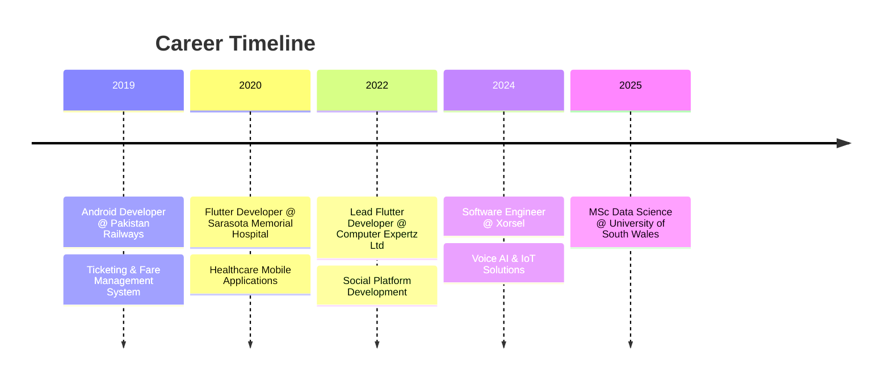

<div align="center">

<!-- Animated Header -->


<!-- Typing Animation -->
<a href="https://git.io/typing-svg"></a>

<!-- Social Badges -->
<p>
  <a href="mailto:codecrud360@gmail.com"></a>
  <a href="https://linkedin.com/in/irfan-bashir360"></a>
  <a href="https://medium.com/@codecrud360"></a>
  <a href="https://github.com/irfan-bashir"></a>
</p>

<!-- Profile Views & Followers -->
<p>
  
  
  
</p>

</div>

---

##  Tech Stack & Expertise

<div align="center">
```ascii
╔══════════════════════════════════════════════════════════════════════════════╗
║                           🧠 CORE COMPETENCIES                                ║
╠══════════════════════════════════════════════════════════════════════════════╣
║  Data Science & AI  ████████████████████░░░░  85%  │  Machine Learning Expert ║
║  Mobile Development ██████████████████████░░  95%  │  Flutter Specialist      ║
║  Backend Systems    █████████████████░░░░░░░  75%  │  API Architecture        ║
║  IoT & Hardware     ████████████████░░░░░░░░  70%  │  Embedded Systems        ║
╚══════════════════════════════════════════════════════════════════════════════╝
```

</div>

### 🤖 Data Science & Artificial Intelligence

<div align="center">
  
</div>
```python
class DataScientist:
    def __init__(self):
        self.name = "Irfan Bashir"
        self.role = "Data Scientist & ML Engineer"
        
    def skills(self):
        return {
            "machine_learning": ["TensorFlow", "PyTorch", "Scikit-learn", "Keras", "XGBoost"],
            "data_analysis": ["Pandas", "NumPy", "SciPy", "Statsmodels"],
            "visualization": ["Power BI", "Matplotlib", "Seaborn", "Plotly", "Tableau"],
            "big_data": ["Apache Spark", "Hadoop", "Databricks"],
            "nlp": ["NLTK", "spaCy", "Transformers", "Hugging Face"],
            "deep_learning": ["CNN", "RNN", "LSTM", "GANs", "Transformers"]
        }
    
    def current_focus(self):
        return "MSc Data Science @ University of South Wales"
```

<div align="center">
  
  
  
  
  
  
  
</div>

---

### 📱 Mobile Development & Flutter

<div align="center">
  
</div>
```dart
class FlutterDeveloper {
  final String name = "Irfan Bashir";
  final int yearsOfExperience = 5;
  
  Map<String, dynamic> get expertise => {
    "frameworks": ["Flutter", "React Native"],
    "state_management": ["BLoC", "Cubit", "Provider", "Riverpod", "GetX"],
    "architecture": ["MVC", "MVVM", "MVP", "Clean Architecture"],
    "backend_integration": ["Firebase", "Supabase", "REST APIs", "GraphQL"],
    "local_storage": ["SQLite", "Hive", "SharedPreferences", "Drift"],
    "deployment": ["App Store", "Google Play", "TestFlight", "Firebase Distribution"],
    "specialties": ["Offline-First Apps", "Bluetooth Integration", "Real-time Features"]
  };
  
  List<String> get achievements => [
    "Led development of multi-platform healthcare apps",
    "Built offline ticketing system for Pakistan Railways",
    "Created social platform with 10K+ users"
  ];
}
```

<div align="center">
  
  
  
  
  
  
  
</div>

---

### ⚙️ Backend & Cloud Infrastructure

<div align="center">
  
</div>
```yaml
backend_expertise:
  frameworks:
    - Django & Django REST Framework
    - Flask & FastAPI
    - Node.js & Express
    - ABP Framework (C#)
    
  cloud_platforms:
    aws:
      - EC2, S3, Lambda
      - RDS, DynamoDB
      - API Gateway
      - AWS IoT Core
    google_cloud:
      - Compute Engine
      - Cloud Functions
      - Firestore
      - Google Cloud IoT
    azure:
      - Azure Functions
      - Azure IoT Hub
      - Cosmos DB

  databases:
    sql: [PostgreSQL, MySQL, SQLite]
    nosql: [MongoDB, Firebase Firestore, Redis]
    
  devops:
    containers: [Docker, Kubernetes]
    ci_cd: [Jenkins, GitHub Actions, Bitbucket Pipelines]
    tools: [Jira, Postman, Figma, Git]
```

<div align="center">
  
  
  
  
  
  
  
</div>

---

### 🔌 IoT & Embedded Systems

<div align="center">
  
</div>
```c
/* IoT & Hardware Integration Expertise */

#define EXPERIENCE_YEARS 5
#define PROJECTS_COMPLETED 20+

typedef struct {
    char* platforms[4];
    char* protocols[4];
    char* hardware[5];
    char* applications[4];
} IoT_Skills;

IoT_Skills skills = {
    .platforms = {"AWS IoT Core", "Azure IoT Hub", "Google Cloud IoT", "ThingsBoard"},
    .protocols = {"MQTT", "BLE", "UART", "HTTP/WebSocket"},
    .hardware = {"Arduino", "Raspberry Pi", "ESP8266", "ESP32", "STM32"},
    .applications = {
        "Smart Metering Systems",
        "Home Automation",
        "Industrial Monitoring",
        "Voice-Controlled Devices"
    }
};

// Specialties: Real-time data acquisition, Sensor integration, OTA updates
```

<div align="center">
  
  
  
  
  
  
</div>

---

### 🔧 Programming Languages

<div align="center">
```
                    ┌─────────────────────────────────────────────────────────┐
                    │                   LANGUAGE PROFICIENCY                   │
                    ├─────────────────────────────────────────────────────────┤
                    │                                                         │
   Python     ██████████████████████████████████████████████░░░░  92%        │
   Dart       ████████████████████████████████████████████████░░  96%        │
   TypeScript ██████████████████████████████████████░░░░░░░░░░░░  80%        │
   C++        █████████████████████████████████░░░░░░░░░░░░░░░░░  70%        │
   Java       ████████████████████████████████████░░░░░░░░░░░░░░  75%        │
   Kotlin     █████████████████████████████████░░░░░░░░░░░░░░░░░  70%        │
   R          ████████████████████████████████░░░░░░░░░░░░░░░░░░  68%        │
   SQL        ██████████████████████████████████████████░░░░░░░░  85%        │
                    │                                                         │
                    └─────────────────────────────────────────────────────────┘
```

</div>

<div align="center">
  
  
  
  
  
  
  
</div>

---

## 💼 Professional Journey


### 🚀 Xorsel | Software Engineer
**📍 Cardiff, UK | Present**

- 📱 Developing cross-platform mobile applications using Flutter & Dart
- 🎙️ Building Voice AI solutions and custom software for businesses
- 🔌 Creating IoT-integrated metering and monitoring applications
- 🔗 Implementing REST API integrations and real-time data synchronization
- 📊 Designing intuitive UI/UX for complex data visualization

### 💻 Computer Expertz Ltd | Lead Flutter Developer
**📍 Kingston, Jamaica | November 2022 - Present**

- 📱 Developed "Conversations for Greatness" mobile and web app using Flutter, BLoC, and Cubit patterns
- 🔐 Integrated OAuth, Firebase, and multimedia features including video/picture posting, DMs, and notifications
- ⚙️ Built backend services with ABP framework in C# and managed API integrations
- 👥 Maintained GitHub codebase, managed branching, and supervised junior developers

### 🏥 Sarasota Memorial Health Care System | Flutter Developer
**📍 Florida, USA | September 2020 - November 2022**

- 📱 Developed three mobile apps for Sarasota Memorial Hospital enhancing patient access across multiple branches
- 👨‍⚕️ Built features for doctor search and appointment booking with qualifications and experience display
- 🩺 Implemented symptom checker tool recommending personal doctors or critical care based on user input
- 🏨 Integrated patient portal with surgery status, event updates, bill payment, careers, and branch locations via Google Maps

### 🚂 Pakistan Railways | Android Developer
**📍 Lahore, Pakistan | October 2019 - July 2020**

- 🎫 Created Flutter app enabling seamless online and offline ticketing for Pakistan Railways
- 📴 Implemented offline ticketing functionality for remote areas with record sync when internet restored
- 🖨️ Integrated Bluetooth support for thermal printers to print tickets and issue fines on the spot
- 🚉 Included features for fare calculations, train schedules, routes, and seat records management

---

## 🚀 Featured Projects

### 💬 Conversations for Greatness
<p>
  
  
  
  
</p>

- 📱 Social platform mobile and web app built with Flutter
- 🎬 Multimedia features - video/picture posting and sharing
- 💬 Direct messaging and real-time notifications
- 🔐 OAuth and Firebase authentication integration
- ⚙️ Backend powered by ABP Framework in C#

### 🏥 Sarasota Memorial Hospital Apps
<p>
  
  
  
</p>

- 🏨 Three mobile apps for multi-branch hospital system
- 👨‍⚕️ Doctor search with qualifications and appointment booking
- 🩺 AI-powered symptom checker with care recommendations
- 📋 Patient portal - surgery status, events, bill payment
- 🗺️ Branch locations with Google Maps integration
- 💼 Career opportunities section

### 🚂 Pakistan Railways Ticketing System
<p>
  
  
  
</p>

- 🎫 Online and offline ticketing system for Pakistan Railways
- 📴 Offline mode for remote areas with automatic sync
- 🖨️ Bluetooth thermal printer integration for instant tickets
- 💰 Fare calculation and fine issuance on the spot
- 🚉 Train schedules, routes, and seat management

### 📊 Uniq Meter App
<p>
  
  
  
</p>

- 📱 Comprehensive metering & monitoring application
- 🔌 Gateway integration and device management
- 📡 Real-time data acquisition from APIs (Netbiter)
- 📄 PDF generation and professional reporting
- 🔐 Firebase authentication and cloud storage

### 🤖 AI Restaurant Kiosk
<p>
  
  
  
</p>

- 🎙️ Voice-powered ordering system with AI capabilities
- 🧠 AI-driven menu recommendations
- 💳 Seamless payment integration
- 📋 Order management dashboard

---

## 🎓 Education & Certifications

### 📚 Master of Science in Data Science
**University of South Wales** | Cardiff, UK | 2025

*Focus: Machine Learning, Big Data Analytics, Statistical Modeling*

### 🏅 Professional Certifications

🔴 **HCIP-Datacom** (Advanced Routing) - Huawei

🟠 **HCIA-Datacom** - Huawei

🟢 **HCIA-AI** - Huawei

---

## 🏆 Achievements & Awards

### 🥇 Speed Programming Champion
**Science Bee'19 | NUST, Islamabad**

- Represented IEEE Society, GCUF
- Competed against students from universities across Pakistan
- Secured the title after successfully navigating two competitive rounds

---

## 🤝 Let's Connect!

<div align="center">

<p>I'm always excited to collaborate on innovative projects!</p>

<a href="mailto:codecrud360@gmail.com">
  
</a>
<a href="https://linkedin.com/in/irfan-bashir360">
  
</a>
<a href="https://medium.com/@codecrud360">
  
</a>
<a href="tel:+447838541003">
  
</a>

<br><br>

### 💼 Open For Opportunities


</div>

---

<div align="center">

### 💭 Philosophy

> *"Transforming ideas into apps, data into insights, and challenges into opportunities."*

</div>

---

<!-- Snake Animation -->
<div align="center">
  
</div>

---

<!-- Footer -->


<div align="center">

**⭐ Star my repositories if you find them useful! ⭐**


</div>
