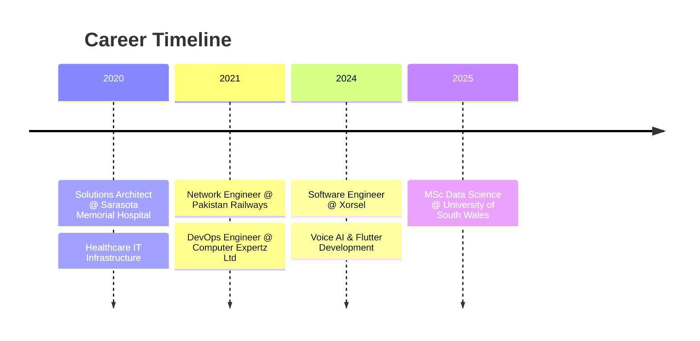

<div align="center">

<!-- Animated Header -->


<!-- Typing Animation -->
<a href="https://git.io/typing-svg"></a>

<!-- Social Badges -->
<p>
  <a href="mailto:codecrud360@gmail.com"></a>
  <a href="https://linkedin.com/in/irfan-bashir360"></a>
  <a href="https://medium.com/@codecrud360"></a>
  <a href="https://github.com/irfan-bashir"></a>
</p>

<!-- Profile Views & Followers -->
<p>
  
  
  
</p>

</div>

---

## 🛠️ Tech Arsenal

<details open>
<summary><b>📱 Mobile Development</b></summary>
<br>
<p align="center">
  
</p>

**Framework:** Flutter, React Native

**State Management:** Provider, Riverpod, BLoC, GetX

**Backend:** Firebase, Supabase, REST APIs, GraphQL

**Storage:** SQLite, Hive, SharedPreferences

**Deployment:** App Store, Google Play, TestFlight

</details>

<details open>
<summary><b>🤖 Data Science & AI</b></summary>
<br>
<p align="center">
  
</p>

**ML/DL:** TensorFlow, PyTorch, Scikit-learn, Keras

**Data Analysis:** Pandas, NumPy, SciPy

**Visualization:** Power BI, Matplotlib, Seaborn, Plotly

**Big Data:** Apache Spark, Hadoop

**NLP:** NLTK, spaCy, Transformers

</details>

<details open>
<summary><b>⚙️ Backend & DevOps</b></summary>
<br>
<p align="center">
  
</p>

**Backend:** Django, Flask, FastAPI, Node.js

**Cloud:** AWS, Google Cloud, Azure

**Containers:** Docker, Kubernetes

**Databases:** PostgreSQL, MongoDB, Firebase, SQLite

**CI/CD:** Jenkins, GitHub Actions

</details>

<details>
<summary><b>🔧 Languages & Tools</b></summary>
<br>
<p align="center">
  
</p>
</details>

---

## 💼 Professional Journey


### 🚀 Xorsel | Software Engineer
**📍 Cardiff, UK | Present**

- 📱 Developing cross-platform mobile applications using Flutter & Dart
- 🎙️ Building Voice AI solutions and custom software for businesses
- 🔌 Creating IoT-integrated metering and monitoring applications
- 🔗 Implementing REST API integrations and real-time data synchronization
- 📊 Designing intuitive UI/UX for complex data visualization

### ☁️ Computer Expertz Ltd | DevOps Engineer
**📍 Jamaica | February 2021 - October 2024**

- 🚀 Set up and managed CI/CD pipelines to automate application deployment
- ☁️ Maintained and monitored cloud infrastructure on AWS and Google Cloud
- 🐳 Worked with Docker to containerize applications for scalable deployment
- 📊 Implemented monitoring and logging solutions for system performance
- 👥 Collaborated with development teams to improve deployment processes

### 🏥 Sarasota Memorial Hospital | Solutions Architect
**📍 Florida, USA | September 2020 - August 2022**

- 🏗️ Designed technical solutions and planned infrastructure for healthcare applications
- 📱 Architected scalable application systems with focus on performance and reliability
- 🔗 Led integration planning for multiple hospital systems and third-party services
- 🔐 Ensured security compliance and data protection in healthcare IT infrastructure

### 🌐 Pakistan Railways | Network Engineer
**📍 Lahore, Pakistan | September 2021 - December 2021**

- 🔌 Installed, configured, and maintained network infrastructure
- 🛡️ Configured routers, switches, and firewalls for network security
- 📡 Managed LAN/WAN networks and troubleshot connectivity issues
- 🔒 Implemented VPN and remote access solutions

---

## 🚀 Featured Projects

### 📊 Uniq Meter App
<p>
  
  
  
</p>

- 📱 Comprehensive metering & monitoring application built with Flutter
- 🔌 Gateway integration and device management features
- 📡 Real-time data acquisition from APIs (Netbiter)
- 📄 PDF generation and professional reporting features
- 🔐 Firebase authentication and cloud storage

### 🤖 AI Restaurant Kiosk
<p>
  
  
  
</p>

- 🎙️ Voice-powered ordering system with AI capabilities
- 🧠 AI-driven menu recommendations
- 💳 Seamless payment integration
- 📋 Order management dashboard
- 🎨 Custom UI/UX design

### 🎓 UniConnect South Wales
<p>
  
  
  
</p>

- 👥 Student networking platform for university students
- 💬 Real-time messaging system
- 📅 Event management features
- 🏫 Campus-specific functionality
- 🔔 Push notifications

### 🧠 ML Pipeline Platform
<p>
  
  
  
</p>

- 📈 End-to-end ML pipelines for predictive analytics
- 🎯 Achieved 92% classification accuracy
- 🚀 Flask/Django API deployment
- 📊 Automated model selection
- ⚡ Hyperparameter optimization

---

## 🎓 Education & Certifications

### 📚 Master of Science in Data Science
**University of South Wales** | Cardiff, UK | 2025

*Focus: Machine Learning, Big Data Analytics, Statistical Modeling*

### 🏅 Professional Certifications

🔴 **HCIP-Datacom** (Advanced Routing) - Huawei

🟠 **HCIA-Datacom** - Huawei

🟢 **HCIA-AI** - Huawei

---

## 🏆 Achievements & Awards

### 🥇 Speed Programming Champion
**Science Bee'19 | NUST, Islamabad**

- Represented IEEE Society, GCUF
- Competed against top students from universities across Pakistan
- Secured first place after two competitive rounds

### 🥈 Runner-up Speed Programming
**Comsat University | Wah Cantt**

- National-level programming competition
- Demonstrated exceptional algorithmic problem-solving skills

---

## 📈 Skills & Expertise
```text
Flutter/Dart      ████████████████████░   95%
Python            ███████████████████░░   90%
Machine Learning  ██████████████████░░░   85%
Firebase          ██████████████████░░░   85%
Data Analysis     █████████████████░░░░   80%
Cloud (AWS/GCP)   ████████████████░░░░░   75%
DevOps            ███████████████░░░░░░   70%
```

---

## 🤝 Let's Connect!

<div align="center">

<p>I'm always excited to collaborate on innovative projects!</p>

<a href="mailto:codecrud360@gmail.com">
  
</a>
<a href="https://linkedin.com/in/irfan-bashir360">
  
</a>
<a href="https://medium.com/@codecrud360">
  
</a>
<a href="tel:+447838541003">
  
</a>

<br><br>

### 💼 Open For Opportunities


</div>

---

<div align="center">

### 💭 Philosophy

> *"Transforming ideas into apps, data into insights, and challenges into opportunities."*

</div>

---

<!-- Snake Animation -->
<div align="center">
  
</div>

---

<!-- Footer -->


<div align="center">

**⭐ Star my repositories if you find them useful! ⭐**


</div>
