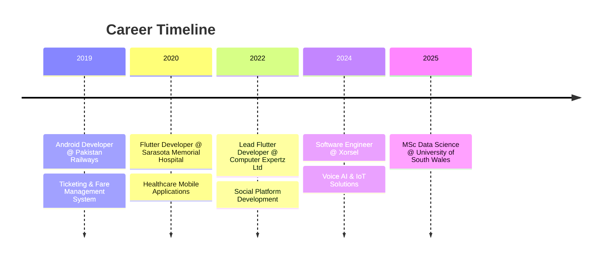

<div align="center">

<!-- Animated Header -->


<!-- Typing Animation -->
<a href="https://git.io/typing-svg"></a>

<!-- Social Badges -->
<p>
  <a href="mailto:codecrud360@gmail.com"></a>
  <a href="https://linkedin.com/in/irfan-bashir360"></a>
  <a href="https://medium.com/@codecrud360"></a>
  <a href="https://github.com/irfan-bashir"></a>
</p>

<!-- Profile Views & Followers -->
<p>
  
  
  
</p>

</div>

---

## 🛠️ Tech Arsenal

<details open>
<summary><b>🤖 Data Science & AI</b></summary>
<br>
<p align="center">
  
</p>

**ML/DL:** TensorFlow, PyTorch, Scikit-learn, Keras

**Data Analysis:** Pandas, NumPy, SciPy

**Visualization:** Power BI, Matplotlib, Seaborn, Plotly

**Big Data:** Apache Spark, Hadoop

**NLP:** NLTK, spaCy, Transformers

</details>

<details open>
<summary><b>📱 Mobile Development</b></summary>
<br>
<p align="center">
  
</p>

**Framework:** Flutter, React Native

**State Management:** BLoC, Cubit, Provider, Riverpod, GetX

**Architecture:** MVC, MVVM, MVP

**Backend:** Firebase, Supabase, REST APIs, GraphQL

**Storage:** SQLite, Hive, SharedPreferences

**Deployment:** App Store, Google Play, TestFlight

</details>

<details open>
<summary><b>⚙️ Backend & DevOps</b></summary>
<br>
<p align="center">
  
</p>

**Backend:** Django, Flask, FastAPI, Node.js, ABP Framework (C#)

**Cloud:** AWS, Google Cloud, Azure

**Containers:** Docker, Kubernetes

**Databases:** PostgreSQL, MongoDB, Firebase, SQLite

**CI/CD:** Jenkins, GitHub Actions, Bitbucket Pipelines

**Tools:** Jira, Postman, Figma

</details>

<details open>
<summary><b>🔌 IoT & Hardware</b></summary>
<br>
<p align="center">
  
</p>

**Platforms:** AWS IoT, Azure IoT, Google Cloud IoT

**Hardware:** Arduino, Raspberry Pi, ESP8266/ESP32

**Protocols:** MQTT, BLE, UART

**Applications:** Home Automation, Home Assistance, Embedded Software Development

</details>

<details>
<summary><b>🔧 Languages & Tools</b></summary>
<br>
<p align="center">
  
</p>
</details>

---

## 💼 Professional Journey


### 🚀 Xorsel | Software Engineer
**📍 Cardiff, UK | Present**

- 📱 Developing cross-platform mobile applications using Flutter & Dart
- 🎙️ Building Voice AI solutions and custom software for businesses
- 🔌 Creating IoT-integrated metering and monitoring applications
- 🔗 Implementing REST API integrations and real-time data synchronization
- 📊 Designing intuitive UI/UX for complex data visualization

### 💻 Computer Expertz Ltd | Lead Flutter Developer
**📍 Kingston, Jamaica | November 2022 - Present**

- 📱 Developed "Conversations for Greatness" mobile and web app using Flutter, BLoC, and Cubit patterns
- 🔐 Integrated OAuth, Firebase, and multimedia features including video/picture posting, DMs, and notifications
- ⚙️ Built backend services with ABP framework in C# and managed API integrations
- 👥 Maintained GitHub codebase, managed branching, and supervised junior developers

### 🏥 Sarasota Memorial Health Care System | Flutter Developer
**📍 Florida, USA | September 2020 - November 2022**

- 📱 Developed three mobile apps for Sarasota Memorial Hospital enhancing patient access across multiple branches
- 👨‍⚕️ Built features for doctor search and appointment booking with qualifications and experience display
- 🩺 Implemented symptom checker tool recommending personal doctors or critical care based on user input
- 🏨 Integrated patient portal with surgery status, event updates, bill payment, careers, and branch locations via Google Maps

### 🚂 Pakistan Railways | Android Developer
**📍 Lahore, Pakistan | October 2019 - July 2020**

- 🎫 Created Flutter app enabling seamless online and offline ticketing for Pakistan Railways
- 📴 Implemented offline ticketing functionality for remote areas with record sync when internet restored
- 🖨️ Integrated Bluetooth support for thermal printers to print tickets and issue fines on the spot
- 🚉 Included features for fare calculations, train schedules, routes, and seat records management

---

## 🚀 Featured Projects

### 💬 Conversations for Greatness
<p>
  
  
  
  
</p>

- 📱 Social platform mobile and web app built with Flutter
- 🎬 Multimedia features - video/picture posting and sharing
- 💬 Direct messaging and real-time notifications
- 🔐 OAuth and Firebase authentication integration
- ⚙️ Backend powered by ABP Framework in C#

### 🏥 Sarasota Memorial Hospital Apps
<p>
  
  
  
</p>

- 🏨 Three mobile apps for multi-branch hospital system
- 👨‍⚕️ Doctor search with qualifications and appointment booking
- 🩺 AI-powered symptom checker with care recommendations
- 📋 Patient portal - surgery status, events, bill payment
- 🗺️ Branch locations with Google Maps integration
- 💼 Career opportunities section

### 🚂 Pakistan Railways Ticketing System
<p>
  
  
  
</p>

- 🎫 Online and offline ticketing system for Pakistan Railways
- 📴 Offline mode for remote areas with automatic sync
- 🖨️ Bluetooth thermal printer integration for instant tickets
- 💰 Fare calculation and fine issuance on the spot
- 🚉 Train schedules, routes, and seat management

### 📊 Uniq Meter App
<p>
  
  
  
</p>

- 📱 Comprehensive metering & monitoring application
- 🔌 Gateway integration and device management
- 📡 Real-time data acquisition from APIs (Netbiter)
- 📄 PDF generation and professional reporting
- 🔐 Firebase authentication and cloud storage

### 🤖 AI Restaurant Kiosk
<p>
  
  
  
</p>

- 🎙️ Voice-powered ordering system with AI capabilities
- 🧠 AI-driven menu recommendations
- 💳 Seamless payment integration
- 📋 Order management dashboard

---

## 🎓 Education & Certifications

### 📚 Master of Science in Data Science
**University of South Wales** | Cardiff, UK | 2025

*Focus: Machine Learning, Big Data Analytics, Statistical Modeling*

### 🏅 Professional Certifications

🔴 **HCIP-Datacom** (Advanced Routing) - Huawei

🟠 **HCIA-Datacom** - Huawei

🟢 **HCIA-AI** - Huawei

---

## 🏆 Achievements & Awards

### 🥇 Speed Programming Champion
**Science Bee'19 | NUST, Islamabad**

- Represented IEEE Society, GCUF
- Competed against students from universities across Pakistan
- Secured the title after successfully navigating two competitive rounds

---

## 📈 Skills & Expertise
```text
Flutter/Dart      ████████████████████░   95%
Python            ███████████████████░░   90%
Machine Learning  ██████████████████░░░   85%
Firebase          ██████████████████░░░   85%
Data Analysis     █████████████████░░░░   80%
IoT Integration   ████████████████░░░░░   75%
Cloud (AWS/GCP)   ████████████████░░░░░   75%
```

---

## 🤝 Let's Connect!

<div align="center">

<p>I'm always excited to collaborate on innovative projects!</p>

<a href="mailto:codecrud360@gmail.com">
  
</a>
<a href="https://linkedin.com/in/irfan-bashir360">
  
</a>
<a href="https://medium.com/@codecrud360">
  
</a>
<a href="tel:+447838541003">
  
</a>

<br><br>

### 💼 Open For Opportunities


</div>

---

<div align="center">

### 💭 Philosophy

> *"Transforming ideas into apps, data into insights, and challenges into opportunities."*

</div>

---

<!-- Snake Animation -->
<div align="center">
  
</div>

---

<!-- Footer -->


<div align="center">

**⭐ Star my repositories if you find them useful! ⭐**


</div>
