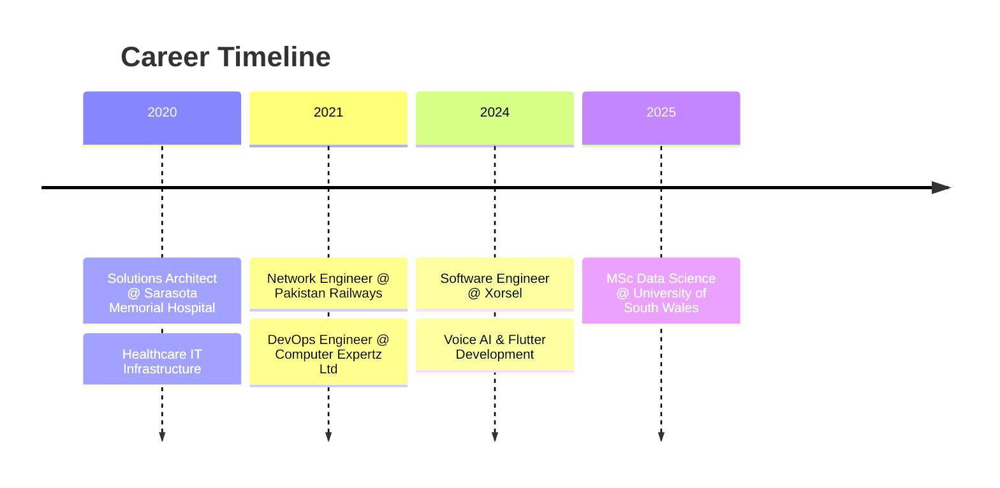

<div align="center">

<!-- Animated Header -->


<!-- Typing Animation -->
<a href="https://git.io/typing-svg"></a>

<!-- Social Badges -->
<p align="center">
  <a href="mailto:codecrud360@gmail.com"></a>
  <a href="https://linkedin.com/in/irfan-bashir360"></a>
  <a href="https://medium.com/@codecrud360"></a>
  <a href="https://github.com/irfan-bashir"></a>
</p>

<!-- Profile Views & Followers -->
<p align="center">
  
  
  
</p>

</div>

<!-- About Section -->


## 🧑‍💻 About Me
```yaml
name: Irfan Bashir
location: Cardiff, UK 🇬🇧
education: MSc Data Science @ University of South Wales
experience: 5+ Years

current_role:
  company: Xorsel
  position: Software Engineer
  focus: 
    - Voice AI Solutions
    - Flutter Development
    - IoT Applications

achievements:
  - 🥇 National Speed Programming Champion
  - 🥈 Runner-up Programming Competition
  - 🎓 Huawei Certified (HCIP & HCIA)

passion: Building apps that make a difference
```

<br clear="right"/>

---

<!-- Tech Stack Section -->
## 🛠️ Tech Arsenal

<details open>
<summary><b>📱 Mobile Development</b></summary>
<br>
<p align="center">
  
</p>

| Category | Technologies |
|----------|-------------|
| **Framework** | Flutter, React Native |
| **State Management** | Provider, Riverpod, BLoC, GetX |
| **Backend** | Firebase, Supabase, REST APIs, GraphQL |
| **Storage** | SQLite, Hive, SharedPreferences |
| **Deployment** | App Store, Google Play, TestFlight |

</details>

<details open>
<summary><b>🤖 Data Science & AI</b></summary>
<br>
<p align="center">
  
</p>

| Category | Technologies |
|----------|-------------|
| **ML/DL** | TensorFlow, PyTorch, Scikit-learn, Keras |
| **Data Analysis** | Pandas, NumPy, SciPy |
| **Visualization** | Power BI, Matplotlib, Seaborn, Plotly |
| **Big Data** | Apache Spark, Hadoop |
| **NLP** | NLTK, spaCy, Transformers |

</details>

<details open>
<summary><b>⚙️ Backend & DevOps</b></summary>
<br>
<p align="center">
  
</p>

| Category | Technologies |
|----------|-------------|
| **Backend** | Django, Flask, FastAPI, Node.js |
| **Cloud** | AWS, Google Cloud, Azure |
| **Containers** | Docker, Kubernetes |
| **Databases** | PostgreSQL, MongoDB, Firebase, SQLite |
| **CI/CD** | Jenkins, GitHub Actions |

</details>

<details>
<summary><b>🔧 Languages & Tools</b></summary>
<br>
<p align="center">
  
</p>
</details>

---

<!-- GitHub Stats Section -->
## 📊 GitHub Analytics

<p align="center">
  
  
</p>

<p align="center">
  
</p>

<!-- Activity Graph -->
<p align="center">
  
</p>

---

<!-- Experience Section -->
## 💼 Professional Journey


<table>
<tr>
<td width="50%">

### 🚀 Xorsel | Software Engineer
**📍 Cardiff, UK | Present**
```diff
+ Flutter & Dart Development
+ Voice AI Solutions
+ IoT Metering Applications
+ REST API Integrations
+ UI/UX Design
```

</td>
<td width="50%">

### ☁️ Computer Expertz | DevOps Engineer
**📍 Jamaica | 2021 - 2024**
```diff
+ CI/CD Pipeline Management
+ AWS & Google Cloud
+ Docker Containerization
+ System Monitoring
+ Team Collaboration
```

</td>
</tr>
</table>

---

<!-- Projects Section -->
## 🚀 Featured Projects

<table>
<tr>
<td width="50%">

<h3 align="center">📊 Uniq Meter App</h3>
<p align="center">
  
  
  
</p>
```
📱 Comprehensive metering & monitoring app
🔌 Gateway & device management
📡 Real-time API data acquisition
📄 PDF generation & reporting
🔐 Firebase authentication
```

</td>
<td width="50%">

<h3 align="center">🤖 AI Restaurant Kiosk</h3>
<p align="center">
  
  
  
</p>
```
🎙️ Voice-powered ordering system
🧠 AI menu recommendations
💳 Seamless payment integration
📋 Order management dashboard
🎨 Custom UI/UX design
```

</td>
</tr>
<tr>
<td width="50%">

<h3 align="center">🎓 UniConnect South Wales</h3>
<p align="center">
  
  
  
</p>
```
👥 Student networking platform
💬 Real-time messaging
📅 Event management system
🏫 Campus-specific features
🔔 Push notifications
```

</td>
<td width="50%">

<h3 align="center">🧠 ML Pipeline Platform</h3>
<p align="center">
  
  
  
</p>
```
📈 End-to-end ML pipelines
🎯 92% classification accuracy
🚀 Flask/Django API deployment
📊 Automated model selection
⚡ Hyperparameter optimization
```

</td>
</tr>
</table>

---

<!-- Education & Certifications -->
## 🎓 Education & Certifications

<table>
<tr>
<td width="60%">

### 📚 Education


**Master of Science in Data Science**  
University of South Wales  
📍 Cardiff, UK | 🗓️ 2025  
*Focus: Machine Learning, Big Data Analytics*

</td>
<td width="40%">

### 🏅 Certifications

| Badge | Certification |
|:-----:|--------------|
| 🔴 | **HCIP-Datacom** (Advanced Routing) |
| 🟠 | **HCIA-Datacom** |
| 🟢 | **HCIA-AI** |

*Issued by Huawei*

</td>
</tr>
</table>

---

<!-- Achievements Section -->
## 🏆 Achievements & Awards

<div align="center">

| 🥇 | 🥈 |
|:---:|:---:|
| **Speed Programming Champion** | **Runner-up Programming** |
| Science Bee'19 @ NUST, Islamabad | Comsat University, Wah Cantt |
| Represented IEEE Society, GCUF | National-level Competition |
| *First place after two rounds* | *Exceptional problem-solving* |

</div>

---

<!-- Skills Progress -->
## 📈 Skills & Expertise
```text
Flutter/Dart      ████████████████████░   95%
Python            ███████████████████░░   90%
Machine Learning  ██████████████████░░░   85%
Firebase          ██████████████████░░░   85%
Data Analysis     █████████████████░░░░   80%
Cloud (AWS/GCP)   ████████████████░░░░░   75%
DevOps            ███████████████░░░░░░   70%
```

---

<!-- Connect Section -->
## 🤝 Let's Connect!

<div align="center">

<p>I'm always excited to collaborate on innovative projects!</p>

<a href="mailto:codecrud360@gmail.com">
  
</a>
<a href="https://linkedin.com/in/irfan-bashir360">
  
</a>
<a href="https://medium.com/@codecrud360">
  
</a>
<a href="tel:+447838541003">
  
</a>

<br><br>

### 💼 Open For Opportunities


</div>

---

<!-- Quote Section -->
<div align="center">

### 💭 Philosophy

> *"Transforming ideas into apps, data into insights, and challenges into opportunities."*

</div>

---

<!-- Snake Animation -->
<div align="center">
  
</div>

---

<!-- Footer -->


<div align="center">

**⭐ Star my repositories if you find them useful! ⭐**


</div>
