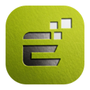

<!-- Animated Header -->

<!-- Typing Animation -->

<!-- Social Badges -->

  
  
  
  

---

## 🎯 About Me

AI/ML Engineer & Data Scientist with **5+ years building production Python systems**, now specializing in **agentic LLM pipelines, RAG, and applied ML**. Master of Data Science candidate experienced in taking models from evaluation to deployment — vector search, LLM orchestration, and cloud deployment on AWS/GCP.

> 🔦 **Flagship project → [Transaction Classifier](https://github.com/irfanbashir360/txn-classifier):** an agentic LLM pipeline reaching **87.8% accuracy** across 36 accounting categories, with confidence-based human-review routing and layered anti-hallucination guardrails.

- 🎓 MSc Data Science @ University of South Wales · 🧠 Huawei **HCIA-AI** certified
- 🏗️ Backend, mobile & cloud engineering background — I ship, not just prototype
- 📍 Cardiff, UK · open to **AI/ML Engineer · Data Scientist** roles

---

## 🛠️ Tech Stack

<table>
  <tr>
    <td valign="top" align="right"><b>🤖&nbsp;AI&nbsp;/&nbsp;LLM</b></td>
    <td>
      
      
      
      
      
      
      
      
      
    </td>
  </tr>
  <tr>
    <td valign="top" align="right"><b>📊&nbsp;Data&nbsp;Science</b></td>
    <td>
      
      
      
      
      
      
      
    </td>
  </tr>
  <tr>
    <td valign="top" align="right"><b>⚙️&nbsp;Backend&nbsp;&amp;&nbsp;Cloud</b></td>
    <td>
      
      
      
      
      
      
      
    </td>
  </tr>
  <tr>
    <td valign="top" align="right"><b>🗄️&nbsp;Databases</b></td>
    <td>
      
      
      
      
      
    </td>
  </tr>
  <tr>
    <td valign="top" align="right"><b>📱&nbsp;Mobile</b></td>
    <td>
      
      
      
      
      
    </td>
  </tr>
  <tr>
    <td valign="top" align="right"><b>🔧&nbsp;Tools&nbsp;&amp;&nbsp;DevOps</b></td>
    <td>
      
      
      
      
      
      
    </td>
  </tr>
  <tr>
    <td valign="top" align="right"><b>🌱&nbsp;Learning</b></td>
    <td>
      
      
      
    </td>
  </tr>
</table>

---

## 🚀 Featured Projects

<table>
  <tr>
    <td align="center" width="90"></td>
    <td><a href="https://github.com/irfanbashir360/txn-classifier"><b>Transaction Classifier</b></a> Agentic LLM pipeline classifying bank transactions into 36 accounting categories at <b>87.8% accuracy</b> — RAG merchant memory, confidence-based human-review routing, and layered anti-hallucination guardrails.</td>
  </tr>
  <tr>
    <td align="center" width="90"></td>
    <td><a href="https://easi-app.co.uk"><b>EASI APP</b></a> Enterprise Flutter field-metering platform — offline-first QR capture across electric/water/gas/thermal assets, event-driven BLoC architecture, real-time Firebase sync (Firestore · Cloud Functions · FCM · Crashlytics), role-based multi-tenant company management, and automated PDF/Excel reporting. &nbsp;·&nbsp; <a href="https://play.google.com/store/apps/details?id=com.uniq.meterreading">Play Store</a> · <a href="https://apps.apple.com/us/app/easi-app/id6747506964">App Store</a></td>
  </tr>
  <tr>
    <td align="center" width="90"></td>
    <td><a href="https://www.joanduncanfoundation.org/conversations-cfg"><b>Conversations for Greatness</b></a> Flutter social platform with multimedia posts, DMs, and real-time notifications. &nbsp;·&nbsp; <a href="https://play.google.com/store/apps/details?id=com.app.mycfg">Play Store</a> · <a href="https://apps.apple.com/us/app/joan-duncan-foundation-mycfg/id6736577915">App Store</a></td>
  </tr>
  <tr>
    <td align="center" width="90"></td>
    <td><a href="https://www.smh.com/smhapp"><b>Sarasota Memorial Hospital Apps</b></a> Three Flutter healthcare apps — doctor search, appointment booking, and a rule-based symptom checker. &nbsp;·&nbsp; <a href="https://play.google.com/store/apps/details?id=com.soln.SE35BCA74A3BE95A854E67E90FEB1DBB3">Play Store</a> · <a href="https://apps.apple.com/pk/app/sarasota-memorial/id397478168">App Store</a></td>
  </tr>
  <tr>
    <td align="center" width="90"></td>
    <td><b>Pakistan Railways Ticketing</b> Offline-first mobile ticketing with Bluetooth thermal-printer support and on-the-spot fine issuance.</td>
  </tr>
</table>

---

## 🎓 Education & Certifications

<table>
  <tr>
    <td align="center" width="90" valign="top"></td>
    <td>
      <b>MSc Data Science</b> 
      <a href="https://www.southwales.ac.uk">University of South Wales</a> · Cardiff, UK · 2025 – 2026
      

        
📄 <b>Thesis</b> &nbsp;·&nbsp; 

         
        Dissertation underway as part of my MSc — title and abstract coming soon.
        <!-- ✏️ Replace the line above when ready: **<Thesis Title>** — <one-line focus>. Methods: <RAG · Transformers · …>. Supervisor: <name>. [Read the thesis](<link>) -->
      

    </td>
  </tr>
  <tr>
    <td align="center" width="90" valign="top"></td>
    <td>
      <b>BS Software Engineering</b> 
      <a href="https://gcuf.edu.pk">Government College University Faisalabad (GCUF)</a> · Pakistan · 2018 – 2022
      

        
📄 <b>Final Year Project</b> &nbsp;·&nbsp; Object-Tracking Drone

         
        Real-time detection and tracking of a targeted moving object using image processing on a Raspberry Pi (Python) — an autonomous drone that locks onto and follows its target.
      

    </td>
  </tr>
</table>

### 🏅 Certifications (Huawei)

🟢 **HCIA-AI** — Artificial Intelligence

🔴 **HCIP-Datacom** — Advanced Routing

🟠 **HCIA-Datacom**

---

## 🏆 Achievements & Leadership

- 🥇 **Winner** — Speed Programming Competition, Science Bee '19, NUST Islamabad *(national level)*
- 🥈 **Runner-Up** — Speed Programming Competition, COMSATS University *(national level)*
- 🧑‍💼 **General Secretary** — IEEE Computer Society, GCUF (2020 – 2022)

---

## 🤝 Let's Connect!

  

### 💼 Open For Opportunities

---

> *"Taking ML from evaluation to deployment — agentic LLM pipelines, RAG, applied ML."*

---

<!-- Footer -->

